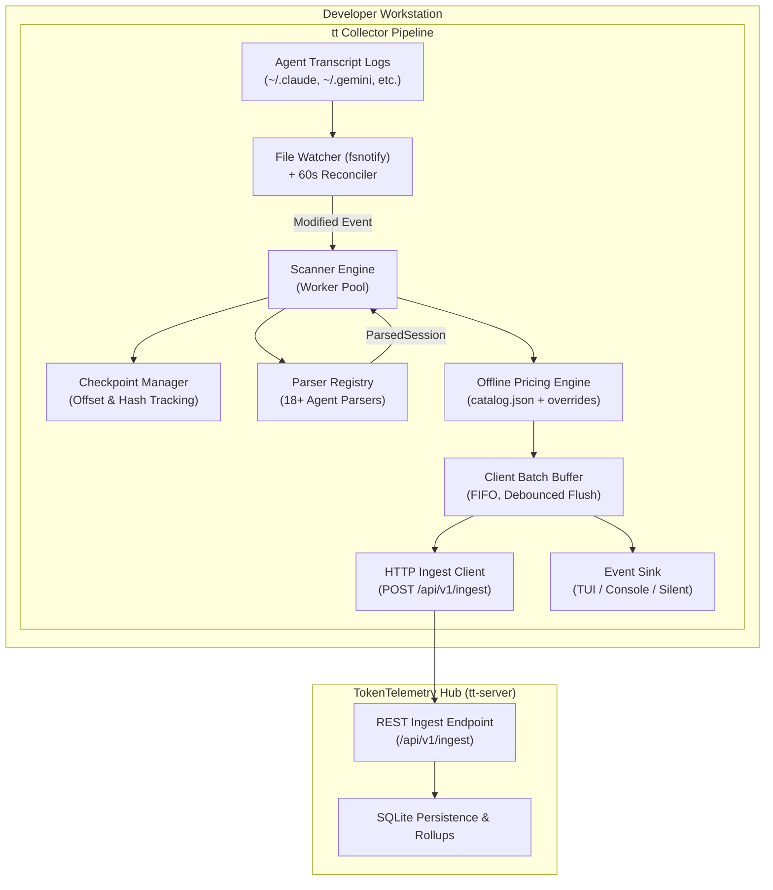
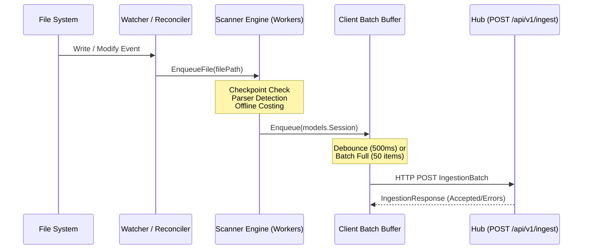

# TokenTelemetry Collector (`tt`) Architecture

The **Collector** (`tt`) is a lightweight, single-binary CLI utility running locally on a developer's workstation. Its responsibility is to passively monitor AI coding agent activity, parse conversation transcripts, calculate token costs offline, and stream structured telemetry batches to the TokenTelemetry Hub (`tt-server`).

---

## 1. System Topology & Core Components



### Component Directory Map

| Component | Directory / Source Files | Primary Responsibility |
| :--- | :--- | :--- |
| **CLI Commands** | [`cmd/tt/`](../cmd/tt/) | Cobra command hierarchy (`tt`, `watch`, `scan`, `sessions`, `send`, `config`, `status`). |
| **Pipeline Coordinator** | [`internal/collector/pipeline.go`](../internal/collector/pipeline.go) | Orchestrates discovery, watching, scanning, pricing, sinking, and batch transmission. |
| **Configuration** | [`internal/collector/config.go`](../internal/collector/config.go) | YAML configuration (`~/.tokentelemetry/config.yaml`) and environment variable overrides. |
| **File Watcher & Reconciler** | [`internal/watcher/`](../internal/watcher/) | `fsnotify` event handler and recurring fallback directory reconciler. |
| **Scanner Engine** | [`internal/scanner/engine.go`](../internal/scanner/engine.go) | Concurrent worker pool, checkpoint verification, and parser dispatch. |
| **Pricing Engine** | [`internal/pricing/engine.go`](../internal/pricing/engine.go) | Offline token pricing resolver with cache hit discounts and power modeling. |
| **Batch Buffer & Client** | [`internal/client/`](../internal/client/) | Bounded queue, debouncing timers, retry policies, and HTTP client. |
| **Presentation Sinks** | [`internal/collector/sink.go`](../internal/collector/sink.go) | Bubbletea TUI, scrolling standard output console, or silent daemon sinks. |

---

## 2. Execution Modes & CLI Subcommands

### 1. `tt watch` (Continuous Daemon Mode)

The default execution mode when invoking `tt` without subcommands:
- **Scan Roots Discovery**: Evaluates standard agent paths (`~/.gemini/antigravity-cli/brain`, `~/.claude/projects`, `~/.codex/sessions`, `~/.cursor/projects`, etc.) or user-configured `scan_roots`.
- **`fsnotify` File Watcher**: Recursively attaches filesystem watches to transcript directories ([`internal/watcher/watcher.go`](../internal/watcher/watcher.go)).
- **Background Reconciler**: Runs a 60-second periodic pass to detect file creations or modifications that bypass OS file-notification queues.
- **Interactive TUI / Console**: Streams active session turns, token throughput, and real-time USD costs.
- **Implementation**: [`cmd/tt/watch.go`](../cmd/tt/watch.go).

### 2. `tt scan [paths...]` (One-Off Discovery Sweep)

Used for cold-start scans, auditing, or batch ingestion:
- Synchronously walks specified root directories (or default configured paths).
- Ignores irrelevant directories (`.git`, `node_modules`, `.cache`, `dist`).
- Parses, costs, and summarizes total files, sessions, message turns, tokens, and USD costs.
- Streams ingestion batches to the Hub (or suppresses network transmissions when `--dry-run` is passed).
- **Implementation**: [`cmd/tt/scan.go`](../cmd/tt/scan.go).

### 3. `tt send` (Targeted Transmission & Testing)

- `tt send <filepath>`: Directly parses, costs, and transmits a specific transcript file.
- `tt send --synthetic`: Deterministically generates a realistic mock multi-turn agent session and transmits it to the Hub to verify end-to-end connectivity.
- **Implementation**: [`cmd/tt/send.go`](../cmd/tt/send.go).

### 4. `tt status` (Environment & Hub Health Check)

- Pings Hub health probe (`GET /healthz`), measuring endpoint latency and server version.
- Displays resolved machine ID, power profile, active scan roots, and configured auth token status.
- **Implementation**: [`cmd/tt/status.go`](../cmd/tt/status.go).

### 5. `tt sessions` (Local Session Querying)

- Inspects recently discovered local sessions directly from disk without querying the Hub.
- Supports filtering by agent harness (`--harness antigravity`), model, or count limit.
- **Implementation**: [`cmd/tt/sessions.go`](../cmd/tt/sessions.go).

---

## 3. Concurrency, Ingestion Buffering, and Resiliency



### Worker Pool Model
The `ScannerEngine` ([`internal/scanner/engine.go`](../internal/scanner/engine.go)) maintains an internal task queue (`chan string`) drained by concurrent worker goroutines (`min(runtime.NumCPU(), 8)`). Each worker independently:
1. Validates checkpoint state (size, modtime, hash) via `CheckpointManager` ([`internal/scanner/checkpoint.go`](../internal/scanner/checkpoint.go)).
2. Dispatches to the appropriate `AgentParser`.
3. Calculates turn-by-turn and gross/net costs via `PricingEngine` ([`internal/pricing/engine.go`](../internal/pricing/engine.go)).
4. Enqueues the resulting `models.Session` into the batch queue.

### Batch Buffer & Debounce Mechanics
To prevent flooding the Hub server with individual HTTP requests per log line:
- The buffer ([`internal/client/buffer.go`](../internal/client/buffer.go)) holds up to `MaxQueueSize` (default 5,000) sessions.
- Flushing occurs when **either** `BatchSize` (default 50 sessions) is met **or** `FlushInterval` (default 500ms) elapses.
- Transmissions use exponential backoff with jitter (`MaxRetries: 5`, initial 500ms, max 15s delay) in the HTTP client ([`internal/client/ingest.go`](../internal/client/ingest.go)).

---

## 4. Configuration Management

Configuration is loaded from `~/.tokentelemetry/config.yaml` ([`internal/collector/config.go`](../internal/collector/config.go)) with the following precedence:
1. **CLI Flags** (`--hub`, `--api-key`, `--machine-id`, `--log-level`)
2. **Environment Variables** (`TT_HUB_URL`, `TT_AUTH_TOKEN`, `TT_MACHINE_ID`, `TT_SCAN_DIR`, `TT_LOG_LEVEL`)
3. **Configuration File** (`~/.tokentelemetry/config.yaml`)
4. **Hardcoded Defaults**

```yaml
hub_url: "http://localhost:8000"
auth_token: ""
machine_id: "workstation-mac-8a3f9b2"
scan_roots:
  - "/Users/user/.gemini/antigravity-cli/brain"
  - "/Users/user/.claude/projects"
log_level: "info"
batch_size: 50
flush_ms: 500
daemon: false
power_profile: "default"
max_retries: 5
timeout_sec: 15
```
