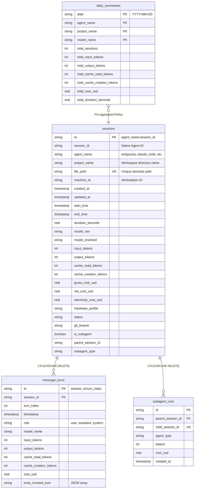
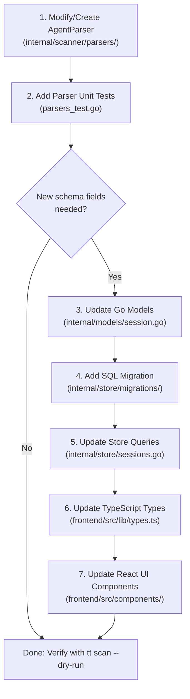

# Agent Transcript Parsing, Storage Schema, and UI Integration

This document serves as the developer and maintainer guide for how **TokenTelemetry** parses transcript files from diverse AI coding agent harnesses, persists them in SQLite, and propagates telemetry into the Astro/React frontend. It also contains the **Agent Harness Schema Change Playbook** for handling log format evolutions.

---

## 1. Transcript Parsing Mechanism

Agent transcript logs are written by external AI coding tools to disk during development sessions. The scanner engine uses an extensible parser architecture based on the [`AgentParser`](../internal/scanner/parsers/parser.go) interface.

```go
type AgentParser interface {
    AgentName() string
    Detect(filePath string) bool
    Parse(r io.Reader, startOffset int64) (*ParsedSession, int64, error)
}
```

The [`Registry`](../internal/scanner/parsers/registry.go) tests candidate file paths against all registered parsers:

```mermaid
flowchart LR
    FilePath["File Path on Disk"] --> Reg["Parser Registry"]
    Reg -->|Detect(path) == true| MatchedParser["AgentParser Implementation"]
    MatchedParser --> StreamRead["Stream Lines / Documents"]
    StreamRead --> Extract["Extract Usage, Turns, Subagents, Model"]
    Extract --> ParsedSession["ParsedSession Struct"]
```

---

## 2. Agent Harness Parser Specifications

### 2.1 Google Antigravity ([`internal/scanner/parsers/antigravity.go`](../internal/scanner/parsers/antigravity.go))
- **File Discovery**: `~/.gemini/antigravity-cli/brain/*/transcript.jsonl` and `antigravity-ide`.
- **Ignored Paths**: Filters out chunk files, message directories, tasks, `tokens_cache.json`, and `transcript_full.jsonl` to avoid double counting.
- **Log Format**: JSON Lines (JSONL).
- **Turn Parsing & Field Extraction**:
  - `step_index` $\rightarrow$ `TurnIndex`.
  - `created_at` (RFC3339) $\rightarrow$ `Timestamp`.
  - `source` / `type` $\rightarrow$ Role (`"user"` if `USER_EXPLICIT` or `USER_INPUT`, otherwise `"assistant"`).
  - `tool_calls[].name` $\rightarrow$ `ToolsInvoked` array.
  - Model detection: Scans `<USER_SETTINGS_CHANGE>` tags in content or defaults to `gemini-3.7-flash`.
  - Token metrics: Reads `metrics` or `token_usage` object (`input_tokens`, `output_tokens`, `cache_read_tokens`, `cache_creation_tokens`).
  - **Heuristic Fallback**: If token metrics are missing, approximates token usage as $\frac{\text{len(content)} + \text{len(thinking)}}{4}$.
  - **Subagents**: Scans `INVOKE_SUBAGENT` steps or `conversationId` links to create [`SubagentRun`](../internal/models/session.go) records.

### 2.2 Anthropic Claude Code ([`internal/scanner/parsers/claude.go`](../internal/scanner/parsers/claude.go))
- **File Discovery**: `~/.claude/projects/**/*.jsonl` or `.json`.
- **Log Format**: JSON Lines.
- **Turn Parsing & Field Extraction**:
  - `type`: `"assistant"` or `"user"`.
  - `sessionId` $\rightarrow$ Native session identifier.
  - `message.model` $\rightarrow$ Model name.
  - `message.usage`:
    - `input_tokens` $\rightarrow$ Input tokens.
    - `output_tokens` $\rightarrow$ Output tokens.
    - `cache_read_input_tokens` $\rightarrow$ Cache read tokens.
    - `cache_creation_input_tokens` $\rightarrow$ Cache creation tokens.
  - `message.content[]`: Extract tool calls where `type == "tool_use"`.
  - **Subagent / Sidechains**: Detected via `isSidechain: true`, `agentId`, or `attributionAgent`.

### 2.3 Other Supported Harnesses
- **Cursor** ([`parsers/cursor.go`](../internal/scanner/parsers/cursor.go)): Parses Cursor project telemetry and shadow workspace logs.
- **GitHub Copilot** ([`parsers/copilot.go`](../internal/scanner/parsers/copilot.go)): Scans session state and tool executions in `~/.copilot/session-state`.
- **Cline** ([`parsers/cline.go`](../internal/scanner/parsers/cline.go)): Extracts task histories and API conversation turns from `~/.cline/data`.
- **OpenCode, Grok, Codex, Ollama, Windsurf, Qwen, Pi, MetaMuse, Prime**: Each implement specialized parsers with tailored regexes, timestamp normalizers, and token usage extractors.

---

## 3. SQLite Storage Schema & Database Semantics

The Hub uses SQLite with Write-Ahead Logging (WAL) and foreign keys enabled.



### Atomic Upsert Semantics

When ingesting sessions in [`internal/store/sessions.go`](../internal/store/sessions.go):
1. **Session Record**: Inserted with `ON CONFLICT(id) DO UPDATE SET ...` updating token counts, costs, timestamps, and model names.
2. **Turn Replacement**: All existing turns for the session are deleted (`DELETE FROM message_turns WHERE session_id = ?`) and newly parsed turns are batch-inserted. This ensures in-progress sessions reflect current turn states without duplicates.
3. **Subagent Linkage**: Inserted into `subagent_runs` with `ON CONFLICT(child_session_id) DO UPDATE SET ...`.
4. **Summary Aggregation**: `RollupDailySummariesForDate` runs inside the same transaction to recompute `daily_summaries` for all affected session dates.

---

## 4. Frontend UI Data Flow & TypeScript Types

The frontend is an Astro application with interactive React islands located in [`frontend/src/`](../frontend/src/).

### Schema Mapping Matrix

| Go Model ([`internal/models/session.go`](../internal/models/session.go)) | SQLite Column | TypeScript Interface ([`frontend/src/lib/types.ts`](../frontend/src/lib/types.ts)) | UI Display Component |
| :--- | :--- | :--- | :--- |
| `ID` | `id` | `id: string` | Router key & URL parameter |
| `SessionID` | `session_id` | `session_id: string` | Header badge, search filter |
| `AgentName` | `agent_name` | `agent_name: string` | Color-coded agent pills |
| `ProjectName` | `project_name` | `project_name: string` | [`ProjectList.tsx`](../frontend/src/components/ProjectList.tsx) |
| `GrossCostUSD` | `gross_cost_usd` | `gross_cost_usd: number` | Base cost displays |
| `NetCostUSD` | `net_cost_usd` | `net_cost_usd: number` | Primary cost metric across cards |
| `CacheReadTokens` | `cache_read_tokens` | `cache_read_tokens: number` | Cache hit percentage gauge |
| `Turns` | `message_turns` table | `turns?: MessageTurn[]` | Turn list & tools timeline in [`SessionDetail.tsx`](../frontend/src/components/SessionDetail.tsx) |
| `SubagentRuns` | `subagent_runs` table | `subagent_runs?: SubagentRun[]` | Hierarchical subagent tree |

---

## 5. Playbook: Updating the System When Agent Log Formats Change

Follow this step-by-step workflow whenever an AI coding agent updates its transcript format:



### Step 1: Update the Go Parser
1. Locate the parser in [`internal/scanner/parsers/`](../internal/scanner/parsers/).
2. Adjust the line JSON struct or unmarshaling logic.
3. Verify or update `Detect(filePath string)` if file naming conventions changed.
4. Update `parsers_test.go` with sample snippets from the new log format.

### Step 2: Update Data Models (If Adding New Fields)
1. Add new fields to `models.Session` or `models.MessageTurn` in [`internal/models/session.go`](../internal/models/session.go).
2. Ensure proper `json:"..."` tags match the API payload structure.

### Step 3: Add SQLite Migration
1. Create a new sequential migration in [`internal/store/migrations/`](../internal/store/migrations/) (e.g. `0004_add_reasoning_tokens.sql`):
   ```sql
   ALTER TABLE sessions ADD COLUMN reasoning_tokens INTEGER DEFAULT 0;
   ALTER TABLE message_turns ADD COLUMN reasoning_tokens INTEGER DEFAULT 0;
   ```
2. Update the queries in [`internal/store/sessions.go`](../internal/store/sessions.go) (`UpsertSession`, `SaveSessionWithTurnsAndSubagents`, `GetSessionDetail`, `ListSessions`).

### Step 4: Update Frontend TypeScript Types & UI Components
1. Update interfaces in [`frontend/src/lib/types.ts`](../frontend/src/lib/types.ts).
2. If displaying the field in the session timeline, update [`frontend/src/components/SessionDetail.tsx`](../frontend/src/components/SessionDetail.tsx).
3. If modifying aggregated metrics, update [`frontend/src/components/Dashboard.tsx`](../frontend/src/components/Dashboard.tsx) and [`frontend/src/components/Analytics.tsx`](../frontend/src/components/Analytics.tsx).

### Step 5: Verification
1. Run parser unit tests:
   ```bash
   go test ./internal/scanner/... ./internal/store/...
   ```
2. Test one-off scan with dry-run mode:
   ```bash
   tt scan --dry-run <path-to-updated-log>
   ```
3. Test end-to-end ingestion and verify the UI updates cleanly.
