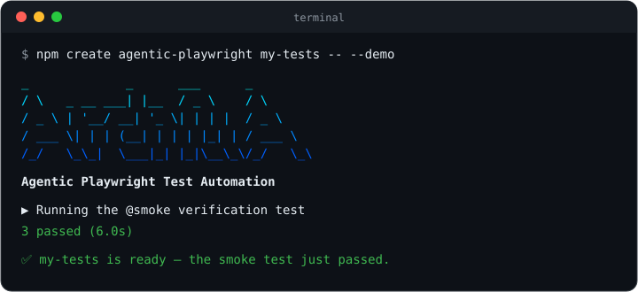

<p align="center">
  
</p>

<h1 align="center">Agentic Playwright</h1>

<p align="center">
  <strong>Stop teaching your AI how to write tests. Hand it the rulebook.</strong>
</p>

<p align="center">
  <a href="https://www.npmjs.com/package/create-agentic-playwright"></a>
  <a href="https://github.com/idavidov13/agentic-playwright/actions/workflows/template-smoke.yml"></a>
  
  <a href="https://nodejs.org/">= 20"></a>
  <a href="https://playwright.dev/"></a>
  <a href="LICENSE"></a>
</p>

<p align="center">
  Production-grade Playwright + TypeScript Scaffold for Agentic Testing.<br>
  A complete, running test framework — page objects, API contracts, data factories, CI —<br>
  plus the AI rules your assistant picks up automatically, from the very first prompt.
</p>

## See it

From the (empty) directory your project should live in — the `.` means "scaffold right
here, and name the project after this folder" (a fresh `git clone` of an empty repo
works too). Prefer a new subfolder? Pass a name instead of `.`:

```bash
npm create agentic-playwright . -- --demo
```

Zero questions. Scaffolds the framework, installs dependencies and a browser, and ends
by running the smoke test against a live demo application — **you see green before
writing a line.** Under 5 minutes on normal broadband.

## Without the rulebook vs with it

The same prompt — _"write a test for the product search"_ — to the same AI assistant:

```ts
// ❌ Unsupervised: XPath, hard waits, `any`, magic timeouts, no structure
test('search', async ({ page }) => {
    await page.goto('https://practicesoftwaretesting.com');
    await page.locator('//input[@id="search-query"]').fill('pliers');
    await page.locator('//button[@type="submit"]').click();
    await page.waitForTimeout(5000);
    const cards: any = await page.$$('.card');
    expect(cards.length > 0).toBe(true);
});
```

```ts
// ✅ With Agentic Playwright: fixtures, steps, web-first assertions
import { expect, test } from '../../../fixtures/pom/test-options';

test(
    'should show only matching products when searching',
    { tag: '@regression' },
    async ({ homePage }) => {
        await test.step('GIVEN the user is on the home page', async () => {
            await homePage.open();
        });

        await test.step('WHEN the user searches for "pliers"', async () => {
            await homePage.searchFor('pliers');
        });

        await test.step('THEN every result matches the search term', async () => {
            await expect(homePage.searchCaption).toContainText('pliers');
            await expect(homePage.productNames.first()).toContainText('Pliers');
        });
    }
);
```

Dependency-injected page objects, Given/When/Then steps, web-first assertions, no hard
waits, no `any`, one tag per test — enforced by a Constitution and 17 skills the
assistant loads automatically, with a write-time hook that blocks the forbidden
patterns outright.

_Not affiliated with Microsoft. [Playwright](https://playwright.dev/) is an open-source project by Microsoft; this scaffold builds on it._

> **This is a scaffold, not a finished framework.** The example files (`AppPage`, `login.spec.ts`, `NavigationComponent`, etc.) demonstrate the patterns and conventions you should follow. Replace them with your real application's pages, tests, and data as you build out your test suite.

---

## Table of Contents

- [Features](#features)
- [Prerequisites](#prerequisites)
- [Quick Start: npm create](#quick-start-npm-create)
- [Quick Start: Dev Container](#quick-start-dev-container)
    - [Claude Code Custom Status Line](#claude-code-custom-status-line)
- [Quick Start: Local Setup Script](#quick-start-local-setup-script)
- [Manual Installation](#manual-installation)
- [Getting Started: Adapting the Scaffold](#getting-started-adapting-the-scaffold)
- [Project Structure](#project-structure)
- [Configuration](#configuration)
- [Environment Variables](#environment-variables)
- [Running Tests](#running-tests)
- [Tag Reference](#tag-reference)
- [Writing Tests](#writing-tests)
- [Page Object Model](#page-object-model)
- [API Testing](#api-testing)
- [Data Strategy](#data-strategy)
- [Authentication Setup](#authentication-setup)
- [Code Quality](#code-quality)
- [Coding Standards](#coding-standards)
- [Core Principles (The Constitution)](#core-principles-the-constitution)
- [AI-Assisted Development Workflow](#ai-assisted-development-workflow)
- [AI Rules Architecture](#ai-rules-architecture)
- [Architecture Overview](#architecture-overview)
- [Troubleshooting](#troubleshooting)
- [Agentic Playwright Pro](#agentic-playwright-pro)
- [License](#license)

---

## Features

- **TypeScript** -- Full type safety with strict mode enabled
- **Page Object Model** -- Maintainable and scalable test architecture
- **Fixture-based Architecture** -- Reusable test components with dependency injection
- **API Testing** -- Built-in `apiRequest` fixture with Zod schema validation and helper fixtures for setup/teardown
- **Multi-browser Support** -- Chrome, Firefox, and WebKit configurations
- **Environment Management** -- Flexible `.env` configuration with multi-environment support
- **Authentication Handling** -- Pre-configured storage state for authenticated tests
- **Code Quality** -- ESLint + Prettier + Husky pre-commit hooks
- **Parallel Execution** -- Fast test runs with configurable workers
- **Comprehensive Reporting** -- HTML reports with traces, screenshots, and videos
- **AI-Assisted Development** -- Modular orchestrator rules for Claude Code, Cursor, and GitHub Copilot with glob-scoped auto-loading. Each tool's rule tree (`.claude/`, `.cursor/`, `.github/instructions/`) is self-contained and stands alone.
- **Confidence-Gated Workflow** -- The `ai-native-workflow` skill is the sole entry-point router for non-trivial work. Every plan must include `Confidence: <1-10>`, `Rationale`, and `Unknowns`; below confidence 5 the agent is required to stop and ask the user for the missing primary input rather than emit a plan built on guesses.
- **Constitution Enforcement Hook** -- `.claude/scripts/enforce_constitution.py` is wired as a Claude Code `PreToolUse` hook in `.claude/settings.json`. It blocks any `Write`/`Edit`/`MultiEdit` that would introduce a mechanically-detectable WON'T violation (`waitForTimeout`, `z.object` in schemas, XPath, `@playwright/test` imports in specs, `.json` static data, the `@functional` tag, tags on `test.describe()`) before the file is ever written -- a hard backstop beneath the prompt-level rules.
- **Version Single-Source** -- the root `VERSION` file is the one source of truth for the product version. `npm run version:stamp` writes it into `package.json`; `npm run check:version` asserts `VERSION` == `package.json` == the latest `CHANGELOG.md` heading and fails on drift. Gated in `.husky/pre-commit` (when a version surface is staged) and in CI (`skill-lint.yml`).
- **Pre-Commit Drift Lints** -- `npm run check:skills-drift` keeps Constitution rules anchored in their owning skill's Critical block; `npm run check:skills-references` walks all three rule trees (`.claude/skills/`, `.cursor/skills/`, `.github/instructions/`, `.github/skills/`) and catches broken pointers, orphan references, and broken section anchors between each `SKILL.md` and its `references/` siblings. Both fire from `.husky/pre-commit` whenever any of those trees has files staged.
- **Upstream Skill Sync** -- `skills-lock.json` records the SHA-256 of the locally vendored copies of `skill-creator` (from `anthropics/skills`) and `playwright-cli` (from `@playwright/cli`). `npm run skills:verify` re-hashes the local files and exits non-zero on drift; `npm run skills:reinstall` fetches upstream, overwrites `.claude/skills/<name>/SKILL.md` and `.cursor/skills/<name>/SKILL.md`, and refreshes the lock; `npm run skills:update` re-locks after intentional local edits.
- **Playwright CLI Exploration** -- `playwright-cli` is the default browser exploration path for UI discovery, tracing, storage inspection, and flow capture
- **Out-of-the-Box Anthropic Skills** -- `playwright-cli` and `skill-creator` are reinstalled fresh from the upstream Anthropic packages and tracked via `skills-lock.json` for reproducible installs
- **AI Task Workflows Playbook** -- [`AI-WORKFLOWS.md`](AI-WORKFLOWS.md) maps the exact step sequence for every common flow (API suite for a controller, functional tests from a ticket, E2E suite, debugging, refactors, and more) to its owning skill and phase, with an anti-drift guardrails table -- so AI-assisted execution stays consistent across sessions

## Prerequisites

- **Node.js** v22.x or later
- **npm** v10.x or later

## Quick Start: npm create

The fastest path — scaffold a fresh project with everything wired, straight into the
directory you are standing in:

```bash
npm create agentic-playwright . -- --demo
```

**Why the `.`?** It scaffolds into the **current directory** and names the project
after the folder — the natural fit when you have already created (or cloned) an empty
repo for your tests. The directory must be empty apart from repo bookkeeping like
`.git`; if a git repo already exists there, the initializer detects it and skips
`git init`. Prefer a new subfolder instead? Pass a name:

```bash
npm create agentic-playwright my-tests -- --demo  # same, but in ./my-tests
npm create agentic-playwright .                   # interactive — 4 questions
npm create agentic-playwright . -- --bare         # your own app URLs
```

Useful flags: `--no-claude` / `--no-cursor` / `--no-copilot` (prune AI rule trees you
don't use), `--yes`, `--skip-install`, `--skip-browsers`, `--skip-git`, `--skip-smoke`.

## Quick Start: Dev Container

The fastest way to get a fully working environment. Requires [Docker Desktop](https://www.docker.com/products/docker-desktop/) and a Dev Containers extension for your editor:

- **Cursor**: Install the [Dev Containers extension](https://marketplace.cursorapi.com/items?itemName=devcontainers.devcontainers) by _Dev Containers_.
- **VS Code**: Install the [Dev Containers extension](https://marketplace.visualstudio.com/items?itemName=ms-vscode-remote.remote-containers) by _Microsoft_.

> **Important:** Make sure Docker Desktop is **up and running** before proceeding with the steps below. The Dev Container will fail to build if Docker is not started.

1. **Clone the repository:**

    ```bash
    git clone <your-repository-url>   # replace with your fork/clone URL
    cd playwright-scaffold
    ```

2. **Open in Cursor/VS Code** and accept the prompt to **"Reopen in Container"** (or run `Dev Containers: Reopen in Container` from the Command Palette).

3. **Done.** The Docker image ships with pre-warmed npm and `playwright-cli` browser caches, so `postCreateCommand` completes in seconds even on first start. The container provides Node.js, npm dependencies (on a fast named volume), Playwright test browsers, Python 3, Claude Code CLI, and `playwright`/`playwright-cli` linked into `~/.local/bin`. Edit `env/.env.dev` with your app configuration and run `npm test`.

> **Version alignment:** The Playwright Docker image tag in `.devcontainer/Dockerfile` must match the `@playwright/test` version in `package.json`. When upgrading Playwright, update both.

### Claude Code Custom Status Line

The scaffold includes a custom Claude Code status line that displays git branch, PR status, model, duration, cost, lines changed, and context window usage directly in the terminal.

To enable it, add the following to your `.claude/settings.local.json` (create the file if it doesn't exist):

```json
{
    "statusLine": {
        "type": "command",
        "command": "python3 .claude/scripts/status_line.py"
    }
}
```

This renders a rich status bar at the bottom of the Claude Code terminal:

```
✦ main ● | 📁 project | 🤖 Sonnet 4.6 | ⏳ 12m05s | 💰 $1.42 | + 85 | — 12 | [████████░░░░] 42.5% (85,012/200k)
```

The status line script lives at `.claude/scripts/status_line.py` and uses a Gruvbox Dark color palette. It shows:

| Segment           | Description                                                     |
| ----------------- | --------------------------------------------------------------- |
| **Git branch**    | Current branch with dirty indicator (●)                         |
| **PR status**     | Review state emoji with clickable PR link (requires `gh` CLI)   |
| **Directory**     | Current workspace folder                                        |
| **Model**         | Active Claude model                                             |
| **Duration**      | Session duration                                                |
| **Cost**          | Cumulative API cost                                             |
| **Lines changed** | Lines added/removed in the session                              |
| **Context bar**   | Visual context window usage scaled to the autocompact threshold |

> **Note:** Cost, lines changed, and context bar segments appear dynamically as you interact with Claude Code. A fresh session will only show git, directory, model, and duration.

## Quick Start: Local Setup Script

For terminal-based workflows or if you prefer not to use Docker. Works on macOS and Linux (Windows users: use WSL2).

1. **Clone the repository:**

    ```bash
    git clone <your-repository-url>   # replace with your fork/clone URL
    cd playwright-scaffold
    ```

2. **Run the setup script:**

    ```bash
    bash scripts/setup.sh
    ```

    This automatically installs Node.js v22 (via nvm if needed), npm dependencies, Playwright browsers with system deps, Python 3.11+, links `playwright` and `playwright-cli` into `~/.local/bin`, and installs a dedicated `playwright-cli` Chromium cache. If you already have Node.js v22+ installed, you can also run `npm run setup` — it is equivalent.

3. **Ensure `~/.local/bin` is on your PATH** (if your shell does not already include it):

    ```bash
    export PATH="$HOME/.local/bin:$PATH"
    ```

    This is where the scaffold links `playwright` and `playwright-cli`. Add this line to your `~/.zshrc` or `~/.bashrc` to make it permanent.

4. Edit `env/.env.dev` with your app configuration and run `npm test`.

## Manual Installation

If you prefer to install dependencies manually. Steps 1-3 and 5-6 are identical on all platforms; step 4 differs.

1. **Clone the repository:**

    ```bash
    git clone <your-repository-url>   # replace with your fork/clone URL
    cd playwright-scaffold
    ```

2. **Install npm dependencies:**

    ```bash
    npm install
    ```

3. **Install Playwright test browsers:**

    ```bash
    npx playwright install --with-deps
    ```

4. **Link CLI commands and install `playwright-cli` browsers:**

    **macOS / Linux:**

    ```bash
    bash scripts/link-cli.sh "$(pwd -P)"
    npm run playwright-cli:install-browsers
    ```

    Then ensure `~/.local/bin` is on your PATH (add to `~/.zshrc` or `~/.bashrc` to make permanent):

    ```bash
    export PATH="$HOME/.local/bin:$PATH"
    ```

    **Windows (PowerShell):**

    ```powershell
    npm run playwright-cli:install-browsers
    ```

5. **Set up environment variables:**

    **macOS / Linux:**

    ```bash
    cp env/.env.example env/.env.dev
    ```

    **Windows (PowerShell):**

    ```powershell
    Copy-Item env\.env.example env\.env.dev
    ```

    Edit `env/.env.dev` with your application's configuration.

6. **Run tests:**

    ```bash
    npm test
    ```

## Verify Your Installation

After any setup method, confirm all tools are available:

**macOS / Linux:**

```bash
playwright --version
playwright-cli --version
```

**Windows (PowerShell):**

```powershell
npx playwright --version
playwright-cli --version
```

Expected output (exact versions vary with your installed packages):

```
playwright --version      → Version 1.60.0
playwright-cli --version  → 0.1.13
```

---

## Getting Started: Adapting the Scaffold

This scaffold ships with example files that demonstrate every pattern. Here's how to replace them with your real application code, step by step.

### Step 1: Configure Your Environment

Edit `env/.env.dev` with your application's actual URLs and credentials:

```bash
APP_URL=https://your-real-app.com
API_URL=https://your-real-api.com
APP_EMAIL=your-test-user@example.com
APP_PASSWORD=your-test-password
```

### Step 2: Update Enums

Open `enums/app/app.ts` and replace the placeholder values with your app's actual messages, API endpoints, and storage state paths:

```typescript
export enum Messages {
    LOGIN_SUCCESS = 'Your actual success message',
    LOGIN_ERROR = 'Your actual error message',
    // Add more messages as needed
}

export enum ApiEndpoints {
    LOGIN = '/your/actual/login/endpoint',
    // Add more endpoints as needed
}
```

### Step 3: Create Your First Page Object

Replace `pages/app/app.page.ts` with a page object for your application's actual login page (or whichever page you're testing first). Use the existing file as a template:

1. Update the locators to match your app's actual elements
2. Update the action methods to match your app's actual behavior
3. Keep the same patterns: getter locators, JSDoc comments, `Promise<void>` return types

> **Tip:** If using Cursor with AI, ask it to "navigate to [your-url] and create a page object" -- the AI rules will guide it to use `playwright-cli` by default to explore the page and generate accurate locators.

### Step 4: Update Authentication Setup

Edit `helpers/app/createStorageState.ts` to match your app's actual login flow. The two functions to update:

- `createAppStorageState()` -- Browser-based login for storage state
- `setUserAccessToken()` -- API-based login for access tokens

### Step 5: Write Your First Real Test

Replace the example tests in `tests/app/functional/` with tests for your application. Follow the pattern in the example files:

```typescript
import { expect, test } from '../../../fixtures/pom/test-options';

test.describe('Your Feature', () => {
    test(
        'should do something specific',
        { tag: '@smoke' },
        async ({ appPage }) => {
            await test.step('GIVEN precondition', async () => {
                /* ... */
            });
            await test.step('WHEN action is taken', async () => {
                /* ... */
            });
            await test.step('THEN expected result', async () => {
                /* ... */
            });
        }
    );
});
```

### Step 6: Run and Verify

```bash
npm test
```

### What to Keep vs. What to Replace

| Keep As-Is                                                                | Replace With Your App                                   |
| ------------------------------------------------------------------------- | ------------------------------------------------------- |
| `fixtures/pom/test-options.ts`                                            | `pages/app/*.page.ts` (your page objects)               |
| `fixtures/pom/page-object-fixture.ts` (extend it)                         | `tests/app/**/*.spec.ts` (your tests)                   |
| `fixtures/api/plain-function.ts`                                          | `enums/app/app.ts` (your messages/endpoints)            |
| `fixtures/api/api-types.ts`                                               | `test-data/static/app/*.ts` (your test data)            |
| `fixtures/helper/helper-fixture.ts` (extend it)                           | `test-data/factories/app/*.factory.ts` (your factories) |
| `config/`, `helpers/util/`                                                | `helpers/app/createStorageState.ts` (your auth flow)    |
| `.claude/skills/`, `.cursor/skills/`, `.github/instructions/` (AI skills) | `fixtures/api/schemas/app/` (your API schemas)          |
| `playwright.config.ts` (mostly)                                           | `pages/components/` (your UI components)                |

---

## Project Structure

```
root/
├── .devcontainer/             # Dev Container configuration (Docker-based setup)
│   ├── Dockerfile             # Playwright + Python + pre-warmed npm/CLI caches + Claude Code
│   ├── devcontainer.json      # VS Code/Cursor container settings
│   └── post-create.sh         # Auto-setup script (npm ci, CLI links, env file, etc.)
│
├── .playwright/
│   └── cli.config.json        # playwright-cli browser defaults (Chromium channel)
│
├── scripts/
│   ├── check-rules-drift.sh         # Constitution rules <-> skill Critical-block anchors
│   ├── check-skill-references-drift.sh  # SKILL.md <-> references/ pointers, orphans, anchors
│   ├── check-skill-crossrefs.sh    # Skills Index sync, frontmatter, cross-skill refs
│   ├── check-version-drift.sh      # VERSION <-> package.json <-> CHANGELOG consistency
│   ├── stamp-version.sh            # Stamp VERSION into package.json (single-source)
│   ├── install-playwright-cli-browsers.sh
│   ├── link-cli.sh            # Links playwright/playwright-cli into ~/.local/bin
│   ├── playwright-cli.sh      # Wrapper that isolates PLAYWRIGHT_BROWSERS_PATH for @playwright/cli
│   └── setup.sh               # Local development setup (non-Docker alternative)
│
├── VERSION                    # Single source of truth for the product version
├── CHANGELOG.md               # Release history (newest first)
├── CLAUDE.md                  # AI orchestrator for Claude Code (always loaded)
├── AI-WORKFLOWS.md            # Step-by-step task workflow playbook (anti-drift reference)
├── .claude/                   # Claude Code configuration and AI skills
│   ├── settings.json          # Shared settings (Constitution enforcement PreToolUse hook)
│   ├── settings.local.json    # Local settings (status line, permissions)
│   ├── scripts/
│   │   ├── enforce_constitution.py  # PreToolUse hook: blocks mechanical WON'T violations
│   │   └── status_line.py     # Custom status line renderer (Gruvbox Dark theme)
│   └── skills/                # Detailed AI skills (tool-agnostic)
│       ├── api-testing/       # apiRequest fixture, schema validation, helpers
│       ├── common-tasks/      # Prompt templates, anti-patterns, verification checklist
│       ├── config/            # Configuration patterns, environment variables
│       ├── data-strategy/     # Factories (Faker + Zod) vs static TS data (`.ts` `as const`, three-tier rule)
│       ├── enums/             # Enum conventions, naming, organization
│       ├── fixtures/          # DI pattern, fixture creation, merging
│       ├── helpers/           # Helper function conventions, auth helpers
│       ├── page-objects/      # POM pattern, getter locators, components
│       ├── playwright-cli/    # Default browser exploration workflow for UI discovery
│       ├── pr-reviewer/       # Review a branch as a PR against the base branch, judged by this repo's rules
│       ├── refactor-values/   # Safe refactoring of enum values and static data
│       ├── selectors/         # Exploration-first workflow, selector priority, feedback selectors
│       ├── skill-creator/     # Meta-skill for creating, evaluating, and improving skills
│       ├── test-standards/    # Test structure, tagging, steps, assertions
│       └── type-safety/       # Zod schemas, no-any, TypeScript strict mode
│
├── .cursor/                   # Cursor AI rules and skills
│   ├── rules/
│   │   └── rules.mdc          # AI orchestrator for Cursor (always loaded)
│   └── skills/                # Mirror of .claude/skills/ for Cursor compatibility
│       ├── api-testing/
│       ├── common-tasks/
│       ├── config/
│       ├── data-strategy/
│       ├── enums/
│       ├── fixtures/
│       ├── helpers/
│       ├── page-objects/
│       ├── playwright-cli/
│       ├── pr-reviewer/
│       ├── refactor-values/
│       ├── selectors/
│       ├── skill-creator/
│       ├── test-standards/
│       └── type-safety/
│
├── .github/                   # GitHub Copilot AI instructions
│   ├── copilot-instructions.md        # AI orchestrator for Copilot (always loaded)
│   ├── skills/
│   │   └── skill-creator/             # Meta-skill for creating and improving skills
│   └── instructions/                  # Scoped instructions (auto-injected by file glob)
│       ├── api-testing.instructions.md
│       ├── config.instructions.md
│       ├── data-strategy.instructions.md
│       ├── enums.instructions.md
│       ├── fixtures.instructions.md
│       ├── helpers.instructions.md
│       ├── page-objects.instructions.md
│       ├── playwright-cli.instructions.md
│       ├── refactor-values.instructions.md
│       ├── selectors.instructions.md
│       ├── test-standards.instructions.md
│       └── type-safety.instructions.md
│
├── config/                    # Application configuration
│   ├── app.ts                 # App-specific config (URLs, paths)
│   └── util/                  # Utility configurations
│       └── util.ts
│
├── enums/                     # Constants and enumerations
│   ├── app/                   # App-specific enums
│   │   └── app.ts
│   └── util/                  # Shared enums (roles, etc.)
│       └── roles.ts
│
├── env/                       # Environment configuration
│   ├── .env.example           # Template for environment variables
│   └── .env.dev               # Development environment (git-ignored)
│
├── fixtures/                  # Playwright test fixtures
│   ├── api/                   # API testing utilities
│   │   ├── api-request-fixture.ts  # API request fixture (apiRequest)
│   │   ├── api-types.ts            # TypeScript types for API
│   │   ├── plain-function.ts       # Core API request function (internal)
│   │   └── schemas/                # Zod validation schemas
│   │       ├── app/                # App-specific schemas
│   │       │   └── userSchema.ts
│   │       └── util/               # Common error schemas
│   │           └── errorResponseSchema.ts
│   ├── helper/                # Setup/teardown helper fixtures
│   │   └── helper-fixture.ts      # API-driven precondition fixtures
│   └── pom/                   # Page Object fixtures
│       ├── page-object-fixture.ts  # Page object instantiation
│       └── test-options.ts         # Merged test fixtures (use this)
│
├── helpers/                   # Helper functions
│   ├── app/                   # App-specific helpers
│   │   └── createStorageState.ts   # Authentication helpers
│   └── util/                  # Utility functions
│       └── util.ts
│
├── pages/                     # Page Object Model classes
│   ├── app/                   # App page objects
│   │   └── app.page.ts        # Main application page
│   └── components/            # Reusable UI components
│       └── navigation.component.ts
│
├── test-data/                 # Test data files
│   ├── static/                # Immutable data (boundary/invalid cases)
│   │   └── app/
│   │       └── invalidCredentials.ts
│   └── factories/             # Dynamic data generators (Faker + Zod)
│       └── app/
│           └── user.factory.ts
│
├── tests/                     # Test specifications
│   └── app/                   # App tests
│       ├── auth.setup.ts      # Authentication setup
│       ├── api/               # API tests
│       │   └── login.spec.ts
│       ├── e2e/               # End-to-end tests
│       │   └── e2e.spec.ts
│       └── functional/        # Functional tests
│           └── login.spec.ts
│
├── .gitignore
├── .prettierrc                # Prettier configuration
├── eslint.config.mts          # ESLint configuration (flat config)
├── package.json
├── playwright.config.ts       # Playwright configuration
├── README.md
└── tsconfig.json              # TypeScript configuration
```

## Configuration

### Playwright Configuration

The `playwright.config.ts` file contains all test runner settings:

| Setting            | Local                   | CI                |
| ------------------ | ----------------------- | ----------------- |
| Parallel execution | Enabled                 | Enabled           |
| Workers            | Auto                    | 1                 |
| Retries            | 0                       | 2                 |
| Reporter           | HTML (opens on failure) | Blob + HTML       |
| Traces             | On first retry          | On first retry    |
| Screenshots        | On failure              | On failure        |
| Videos             | Retain on failure       | Retain on failure |

### Browser Projects

| Project    | Description             | Dependencies |
| ---------- | ----------------------- | ------------ |
| `setup`    | Authentication setup    | None         |
| `chromium` | Main tests on Chrome    | `setup`      |
| `firefox`  | Firefox (commented out) | `setup`      |
| `webkit`   | Safari (commented out)  | `setup`      |

### Timeouts

| Timeout            | Value      |
| ------------------ | ---------- |
| Test timeout       | 60 seconds |
| Action timeout     | 10 seconds |
| Navigation timeout | 30 seconds |
| Expect timeout     | 10 seconds |

## Environment Variables

### Setup

1. Copy the example file:

    ```bash
    cp env/.env.example env/.env.dev
    ```

2. Configure your variables in `env/.env.dev`:

    ```bash
    # Application URL (frontend)
    APP_URL=https://your-app-url.com

    # API URL (backend)
    API_URL=https://your-api-url.com

    # Test User Credentials
    APP_EMAIL=your-email@example.com
    APP_PASSWORD=your-secure-password

    # Optional: Additional service URLs
    UTILITY_URL=https://your-utility-service.com
    ```

### Switching Environments

```bash
# Default (dev)
npm test

# Staging environment
ENVIRONMENT=staging npm test

# Production environment (read-only tests)
ENVIRONMENT=prod npm test
```

### Creating New Environments

Create `env/.env.<environment>` files:

- `env/.env.dev` -- Development
- `env/.env.staging` -- Staging
- `env/.env.prod` -- Production

## Running Tests

### Basic Commands

```bash
# Run all tests (excludes @destructive)
npm test

# Run tests on specific browser (excludes @destructive)
npm run test:chromium
npm run test:firefox
npm run test:webkit

# Run in headed mode (see browser)
npm run test:headed

# Run in debug mode (Playwright Inspector)
npm run test:debug

# Run with UI mode (interactive)
npm run test:ui
```

### Running by Tag

Run tests filtered by tag. See the [Tag Reference](#tag-reference) section for the full list of available tags and their meanings.

```bash
# Run by importance level
npm run test:smoke          # Critical path tests
npm run test:sanity         # Key functionality verification
npm run test:regression     # Full regression coverage

# Run by test type
npm run test:api            # API-only tests
npm run test:e2e            # End-to-end user flows

# Run destructive tests only (single worker, isolated)
npm run test:destructive
```

### CI Mode

Optimized for CI environments with single worker, blob reports:

```bash
npm run test:ci
```

### View Reports

```bash
npm run report
```

---

## Tag Reference

Tags control selective test execution. Each test has **exactly one** tag. Apply tags to individual tests via `{ tag: '@smoke' }` -- **never** on `test.describe()` blocks. **`@functional` is forbidden.**

### The Single-Tag Rule

A test gets exactly one tag from this set. **`@destructive` is the heaviest tag and always wins -- but only for shared/global state.** A test that mutates state other tests or users depend on (locale, permissions, roles, guest access, feature flags, global settings) is tagged **only** `@destructive`, regardless of what importance or type tag it would otherwise carry. A test that creates and cleans up **only its own isolated data** is NOT destructive -- tag it by importance (`@smoke`/`@regression`/`@api`/…).

| Tag            | Purpose                                                                                                                               | npm Command                |
| -------------- | ------------------------------------------------------------------------------------------------------------------------------------- | -------------------------- |
| `@smoke`       | Critical path -- run first and frequently                                                                                             | `npm run test:smoke`       |
| `@sanity`      | Key functionality verification                                                                                                        | `npm run test:sanity`      |
| `@regression`  | Full regression coverage of a single behaviour                                                                                        | `npm run test:regression`  |
| `@e2e`         | End-to-end multi-feature user journey                                                                                                 | `npm run test:e2e`         |
| `@api`         | API contract and schema validation                                                                                                    | `npm run test:api`         |
| `@destructive` | Mutates **shared/global** state -- locale, permissions, roles, guest access, feature flags, global settings (overrides any other tag) | `npm run test:destructive` |

### How Tag Filtering Works

- **`npm test`** runs the full suite **excluding** `@destructive` tests (via `--grep-invert`), because the full suite runs in parallel and destructive tests modify shared state.
- **Tag-specific commands** (e.g., `test:smoke`) use `--grep @smoke` to run only matching tests. Because each test has exactly one tag, a `@destructive` test only runs under `npm run test:destructive` -- not under `test:smoke`, `test:regression`, etc.
- **`npm run test:destructive`** runs only `@destructive` tests with `--workers=1` for sequential execution.

### The `@destructive` Tag

`@destructive` is reserved for **shared/global** state -- state that lives outside the test and that other tests, users, or sessions depend on: changing the locale, granting/removing permissions, roles, or guest access, toggling feature flags or global settings, or mutating shared seed data every test reads (e.g. "delete all users"). They follow strict rules:

1. **Excluded from `npm test`** -- The base command uses `--grep-invert @destructive` to prevent them from running in the parallel full-suite execution.
2. **Run via dedicated command** -- `npm run test:destructive` with a single worker.

**Not destructive:** a test that creates its **own** record, asserts, then deletes **only that record** in cleanup is _isolated_, not destructive. Tag it by importance and let it run in the parallel suite.

**Cleanup applies to any state-mutating test.** Every test that writes persistent state -- `@destructive` shared-state tests **and** isolated own-data tests -- MUST use `test.afterEach()` or `test.afterAll()` to revert what it wrote, so subsequent tests always run against a clean environment.

```typescript
test.describe('admin data management', () => {
    test.afterEach(async ({ apiRequest }) => {
        // REQUIRED: Revert state changes made by the test
        await apiRequest({
            method: 'POST',
            url: '/api/admin/reset',
            baseUrl: process.env.API_URL,
        });
    });

    test(
        'should delete all inactive users',
        { tag: '@destructive' },
        async ({ apiRequest }) => {
            // Test modifies shared state, afterEach reverts it
        }
    );
});
```

### Forbidden Tag Patterns

```typescript
// FORBIDDEN -- @functional is not a valid tag
test('should login', { tag: '@functional' }, async ({ appPage }) => { ... });

// FORBIDDEN -- combining tags is not allowed
test('should authenticate', { tag: ['@smoke', '@api'] }, async ({ apiRequest }) => { ... });

// FORBIDDEN -- @destructive must be the ONLY tag (it always wins)
test('should purge cache', { tag: ['@regression', '@destructive'] }, async ({ apiRequest }) => { ... });

// FORBIDDEN -- tags belong on the test, not on the describe
test.describe('Feature @smoke', () => { ... });
```

---

## Writing Tests

### Test File Structure

Always import from the merged fixtures in `test-options.ts`:

```typescript
import { expect, test } from '../../../fixtures/pom/test-options';

test.describe('Feature Tests', () => {
    test.beforeEach(async ({ appPage }) => {
        await appPage.openHomePage();
    });

    test('should perform action', { tag: '@smoke' }, async ({ appPage }) => {
        await test.step('GIVEN user is on the home page', async () => {
            await expect(appPage.appTitle).toBeVisible();
        });

        await test.step('WHEN user performs an action', async () => {
            // Perform action
        });

        await test.step('THEN expected result should occur', async () => {
            // Assert result
        });
    });
});
```

### Using Test Steps

Use `test.step()` for better readability and reporting with Given/When/Then structure:

```typescript
test('descriptive test name', async ({ appPage }) => {
    await test.step('GIVEN user is on the login page', async () => {
        await appPage.openHomePage();
    });

    await test.step('WHEN user enters valid credentials', async () => {
        await appPage.login(email, password);
    });

    await test.step('THEN user should see dashboard', async () => {
        await expect(appPage.username).toBeVisible();
    });
});
```

### Data-Driven Tests

Use loops outside of test blocks to generate individual tests:

```typescript
import { INVALID_LOGIN_ATTEMPTS } from '../../../test-data/static/app/invalidCredentials';

for (const { description, email, password } of INVALID_LOGIN_ATTEMPTS) {
    test(
        `should show error for ${description}`,
        { tag: '@regression' },
        async ({ appPage }) => {
            await appPage.openHomePage();
            await appPage.login(email, password);
            await expect(appPage.errorMessage).toBeVisible();
        }
    );
}
```

## Page Object Model

### Creating Page Objects

Page objects encapsulate locators and actions for a page or component:

```typescript
import { expect, Locator, Page } from '@playwright/test';
import { Messages } from '../../enums/app/app';

export class MyPage {
    constructor(private readonly page: Page) {}

    // ==================== Locators ====================

    get inputField(): Locator {
        return this.page.getByLabel('Email address');
    }

    get submitButton(): Locator {
        return this.page.getByRole('button', { name: 'Submit' });
    }

    // ==================== Feedback Locators ====================

    get successMessage(): Locator {
        return this.page.getByText(Messages.SUBMIT_SUCCESS);
    }

    get errorMessage(): Locator {
        return this.page.getByText(Messages.SUBMIT_FAILED);
    }

    // ==================== Actions ====================

    /**
     * Submits the form and waits for the response.
     * @param {string} value - The value to enter in the form.
     * @returns {Promise<void>}
     */
    async submitForm(value: string): Promise<void> {
        await this.inputField.fill(value);
        await this.submitButton.click();
        await this.page.waitForResponse((response) =>
            response.url().includes('/api/submit')
        );
    }
}
```

### Locator Priority

Use semantic locators in this order of preference:

1. `page.getByRole()` -- Accessibility-based (recommended)
2. `page.getByLabel()` -- Form labels
3. `page.getByPlaceholder()` -- Placeholder text
4. `page.getByText()` -- Text content
5. `page.getByTestId()` -- Test IDs (fallback)
6. `page.locator()` -- CSS/XPath (last resort)

### Registering Page Objects

Add new page objects to `fixtures/pom/page-object-fixture.ts`:

```typescript
import { test as base } from '@playwright/test';
import { AppPage } from '../../pages/app/app.page';
import { MyNewPage } from '../../pages/app/my-new.page';

export type FrameworkFixtures = {
    appPage: AppPage;
    myNewPage: MyNewPage;
};

export const test = base.extend<FrameworkFixtures>({
    appPage: async ({ page }, use) => {
        await use(new AppPage(page));
    },
    myNewPage: async ({ page }, use) => {
        await use(new MyNewPage(page));
    },
});
```

### Using the `resetStorageState` Fixture

The framework provides a `resetStorageState` fixture to clear cookies and permissions during a test. This is useful when testing login flows in authenticated test projects:

```typescript
test.beforeEach(async ({ resetStorageState, appPage }) => {
    await resetStorageState();
    await appPage.openHomePage();
});

test('should login successfully', async ({ appPage }) => {
    await appPage.login(email, password);
    await expect(appPage.username).toBeVisible();
});
```

### Component Pattern

Reusable UI components can be composed into Page Objects:

```typescript
import { NavigationComponent } from '../components/navigation.component';

export class DashboardPage {
    readonly nav: NavigationComponent;

    constructor(private readonly page: Page) {
        this.nav = new NavigationComponent(page);
    }
}

// Usage in tests
await dashboardPage.nav.clickHome();
await dashboardPage.nav.logout();
```

## API Testing

### Making API Requests

Use the `apiRequest` fixture for all API calls in tests:

```typescript
import { expect, test } from '../../../fixtures/pom/test-options';
import {
    UserResponse,
    UserResponseSchema,
} from '../../../fixtures/api/schemas/app/userSchema';

test('should return user data', { tag: '@api' }, async ({ apiRequest }) => {
    const { status, body } = await apiRequest<UserResponse>({
        method: 'GET',
        url: '/api/users/me',
        baseUrl: process.env.API_URL,
        headers: process.env.ACCESS_TOKEN,
    });

    expect(status).toBe(200);
    expect(UserResponseSchema.parse(body)).toBeTruthy();
});
```

Use the `apiRequest` fixture directly for all API work -- assertions, `beforeEach`/`afterEach`, one-off calls. Do not create separate helpers for every endpoint.

### API Request Options

| Option     | Type                                              | Description                                   |
| ---------- | ------------------------------------------------- | --------------------------------------------- |
| `method`   | `'GET' \| 'POST' \| 'PUT' \| 'DELETE' \| 'PATCH'` | HTTP method                                   |
| `url`      | `string`                                          | Endpoint path                                 |
| `baseUrl`  | `string` (optional)                               | Base URL to prepend                           |
| `body`     | `Record<string, unknown>` (optional)              | Request payload                               |
| `headers`  | `string` (optional)                               | Authentication token for Authorization header |
| `authType` | `'Bearer' \| 'Token' \| 'Basic'` (optional)       | Auth scheme (default: `'Bearer'`)             |

### Schema Validation with Zod

Define schemas in `fixtures/api/schemas/`. Zod 4 promotes string format validators to top-level APIs for better tree-shaking and clarity:

```typescript
import { z } from 'zod';

export const UserResponseSchema = z.strictObject({
    id: z.uuid(),
    email: z.email(),
    token: z.string(),
});

export type UserResponse = z.infer<typeof UserResponseSchema>;
```

Use schemas to validate responses:

```typescript
const { body } = await apiRequest<UserResponse>({ ... });

// This will throw if the response doesn't match the schema
const validatedUser = UserResponseSchema.parse(body);
```

### Helper Fixtures for Important Setup/Teardown

For critical, recurring setup/teardown reused across many test files, use helper fixtures in `fixtures/helper/helper-fixture.ts`:

```typescript
// In tests -- the fixture handles lifecycle automatically
test('should edit resource', async ({ createdResource, appPage }) => {
    // createdResource was created via API before this test
    await appPage.navigateToResource(createdResource.id);
    // createdResource is deleted via API after this test (even on failure)
});
```

See `fixtures/helper/helper-fixture.ts` for the full setup/teardown pattern. Use helpers only when the same multi-step setup/teardown is duplicated across 3+ test files.

## Data Strategy

This framework uses a **bifurcated data strategy** to ensure both determinism and test isolation:

### Static Data (`test-data/static/`)

Immutable TypeScript files (`.ts` with `as const` exports) for **curated boundary and invalid data**. This data never changes, ensuring reproducible tests for edge cases. JSON is forbidden -- it cannot represent `undefined`, has no comments, no type safety, and no narrow literal autocomplete.

The scaffold follows a **three-tier rule** (see the `data-strategy` skill):

1. **Universal type-mismatch arrays** (wrong type for any field of a given primitive type) live in `test-data/static/util/invalid-values.ts` as exported `as const` tuples (`INVALID_STRING_VALUES`, `INVALID_NUMBER_VALUES`, `INVALID_BOOLEAN_VALUES`, `INVALID_UUID_VALUES`, `INVALID_ENUM_VALUES`, `INVALID_ARRAY_VALUES`, `INVALID_OBJECT_VALUES`). Import; never redefine inline.
2. **Domain-specific curated invalid sets** (invalid email formats, weak passwords, forbidden enum values, locale strings, etc.) live under `test-data/static/{area}/*.ts` -- this is where new static files usually go.
3. **Field-specific boundary / range values** (e.g., out-of-range for a `1..5` number) may stay inline in the spec file when used in exactly one place.

```
test-data/static/
├── util/
│   └── invalid-values.ts       # Universal type-mismatch tuples (as const)
└── app/
    └── invalidCredentials.ts   # Domain-specific: INVALID_EMAILS, INVALID_PASSWORDS, INVALID_LOGIN_ATTEMPTS
```

**Usage:**

```typescript
import { INVALID_LOGIN_ATTEMPTS } from '../../../test-data/static/app/invalidCredentials';

for (const { description, email, password } of INVALID_LOGIN_ATTEMPTS) {
    test(
        `should reject ${description}`,
        { tag: '@regression' },
        async ({ appPage }) => {
            await appPage.login(email, password);
            await expect(appPage.errorMessage).toBeVisible();
        }
    );
}
```

### Dynamic Data (`test-data/factories/`)

TypeScript factory functions using **Faker + Zod** for generating unique, valid data per test run. This prevents data collision in parallel execution.

```
test-data/factories/
└── app/
    └── user.factory.ts  # generateUser(), generateLoginCredentials()
```

**Usage:**

```typescript
import {
    generateUser,
    generateLoginCredentials,
} from '../../../test-data/factories/app/user.factory';

test('should create user with unique data', async ({ apiRequest }) => {
    // Generate unique user data for this test run
    const user = generateUser();
    const credentials = generateLoginCredentials();

    // Use in API calls or UI interactions
    const { status } = await apiRequest({
        method: 'POST',
        url: '/api/users',
        baseUrl: process.env.API_URL,
        body: { email: credentials.email, password: credentials.password },
    });

    expect(status).toBe(201);
});
```

**Factory with Overrides:**

```typescript
// Generate user with specific properties
const adminUser = generateUser({ email: 'admin@company.com' });

// Generate credentials with specific password
const creds = generateLoginCredentials({ password: 'SpecificPassword123!' });
```

## Authentication Setup

### How It Works

1. `auth.setup.ts` runs before main tests
2. Performs login via API to get access token
3. Performs login via browser to generate storage state
4. Main tests use the saved storage state (already authenticated)

### Storage State

The storage state is saved to `.auth/app/appStorageState.json` and includes:

- Cookies
- localStorage data
- Session information

### Using Authentication in Tests

Tests using the `chromium` project automatically load the storage state:

```typescript
// No login needed - user is already authenticated
test('should show dashboard', async ({ appPage }) => {
    await appPage.openHomePage();
    await expect(appPage.username).toBeVisible();
});
```

### Using API Token

For API tests requiring authentication:

```typescript
const { status, body } = await apiRequest<UserData>({
    method: 'GET',
    url: '/api/protected-resource',
    baseUrl: process.env.API_URL,
    headers: process.env.ACCESS_TOKEN, // Set by auth.setup.ts
});
```

## Code Quality

### Linting

```bash
# Check for issues
npm run lint

# Auto-fix issues
npm run lint:fix
```

### Formatting

```bash
npm run format
```

### Pre-commit Hooks

Husky automatically runs on staged files before each commit:

- ESLint with auto-fix
- Prettier formatting
- Skill drift lints (`check:skills-drift`, `check:skills-references`) -- only when a rule tree is staged
- Version drift lint (`check:version`) -- only when `VERSION`, `package.json`, or `CHANGELOG.md` is staged

### Constitution Enforcement Hook

`.claude/scripts/enforce_constitution.py` is registered as a Claude Code `PreToolUse` hook in `.claude/settings.json` (matcher `Write|Edit|MultiEdit`). It is the deterministic backstop beneath the prompt-level Constitution: it reads the pending tool call on stdin and **blocks** (exit 2, message fed back to the agent) any write that would introduce a mechanically-detectable WON'T violation:

| Blocked                                        | Rule                                                  |
| ---------------------------------------------- | ----------------------------------------------------- |
| `@playwright/test` import in a spec/setup file | Imports must come from `fixtures/pom/test-options.ts` |
| `waitForTimeout(` in any `.ts`                 | No hard waits                                         |
| `z.object(` in a schema file                   | Schemas must use `z.strictObject()`                   |
| XPath selector in `pages/**` or `tests/**`     | No XPath                                              |
| `.json` under `test-data/static/`              | Static data must be `.ts` `as const`                  |
| `@functional` tag in a spec                    | Single-tag rule (six canonical tags only)             |
| Tag inside `test.describe()`                   | Tags on individual tests only                         |

Malformed payloads and non-target files always pass -- the hook never blocks on its own infrastructure errors.

### Versioning

The root `VERSION` file is the single source of truth. To cut a release:

```bash
# 1. Bump the version (writes VERSION, then stamps package.json)
npm run version:stamp 2.5.0

# 2. Add the matching `## v2.5.0` entry at the top of CHANGELOG.md

# 3. Verify all three surfaces agree
npm run check:version
```

`check:version` fails if `VERSION`, `package.json`, and the latest `CHANGELOG.md` heading disagree -- enforced in `.husky/pre-commit` and the `skill-lint.yml` CI workflow.

## Coding Standards

### TypeScript

| Rule             | Description                                           |
| ---------------- | ----------------------------------------------------- |
| Type annotations | Always specify types for parameters and return values |
| Avoid `any`      | Use proper types or `unknown`                         |
| Strict mode      | Enabled in tsconfig.json                              |
| ESNext features  | Optional chaining, nullish coalescing                 |

### Naming Conventions

| Type             | Convention                 | Example                         |
| ---------------- | -------------------------- | ------------------------------- |
| Variables        | camelCase                  | `userName`                      |
| Functions        | camelCase                  | `getUserData()`                 |
| Classes          | PascalCase                 | `AppPage`                       |
| Interfaces/Types | PascalCase                 | `UserResponse`                  |
| Enums            | PascalCase                 | `Roles`                         |
| Enum values      | SCREAMING_SNAKE            | `ADMIN`                         |
| Files            | kebab-case or dot notation | `user-schema.ts`, `app.page.ts` |

### File Naming Conventions

| Type             | Directory                   | Pattern               | Example                   |
| ---------------- | --------------------------- | --------------------- | ------------------------- |
| Page objects     | `pages/app/`                | `[name].page.ts`      | `login.page.ts`           |
| Components       | `pages/components/`         | `[name].component.ts` | `navigation.component.ts` |
| Functional tests | `tests/app/functional/`     | `[name].spec.ts`      | `login.spec.ts`           |
| API tests        | `tests/app/api/`            | `[name].spec.ts`      | `login.spec.ts`           |
| E2E tests        | `tests/app/e2e/`            | `[name].spec.ts`      | `checkout.spec.ts`        |
| Setup files      | `tests/app/`                | `[name].setup.ts`     | `auth.setup.ts`           |
| Data factories   | `test-data/factories/app/`  | `[name].factory.ts`   | `user.factory.ts`         |
| Static data      | `test-data/static/app/`     | `[name].ts`           | `invalidCredentials.ts`   |
| Zod schemas      | `fixtures/api/schemas/app/` | `[name]Schema.ts`     | `userSchema.ts`           |

### Page Object Guidelines

1. **Locators as Getters** -- Use `get` accessors for all locators
2. **Semantic Locators** -- Prefer `getByRole`, `getByLabel` over CSS/XPath
3. **Three Locator Sections** -- Every page object should have: interactive element locators, feedback/validation message locators, and action methods
4. **Action Methods** -- Methods should represent complete user flows
5. **JSDoc on Actions Only** -- Add JSDoc with `@param` and `@returns` to action methods only. Never add JSDoc to locator getters.

### Test Guidelines

1. **Descriptive Names** -- Test names should describe expected behavior
2. **Test Tags** -- Use importance tags (`@smoke`, `@sanity`, `@regression`), type tags (`@e2e`, `@api`), and `@destructive` for tests that modify shared/global state (see [Tag Reference](#tag-reference))
3. **Tags on Tests Only** -- Apply tags to individual tests via `{ tag: '@...' }`, never on `test.describe()` blocks
4. **Test Steps** -- Use `test.step()` with Given/When/Then for readability
5. **Independence** -- Tests should be independent and not rely on other tests
6. **Web-first Assertions** -- Use `toBeVisible`, `toHaveText`, etc.
7. **No Hardcoded Timeouts** -- Rely on Playwright's auto-waiting

---

## Core Principles (The Constitution)

This repository follows a strict architecture designed for **deterministic Playwright testing** and **AI-assisted development**. All code (human or AI-generated) **MUST** adhere to these rules.

### MUST (Mandatory)

| Rule                        | Description                                                                                                                                                                                                                                                                                                                                                                                                                                                                                                                                                                                                                                                                                                                                                                                                                                                                          |
| --------------------------- | ------------------------------------------------------------------------------------------------------------------------------------------------------------------------------------------------------------------------------------------------------------------------------------------------------------------------------------------------------------------------------------------------------------------------------------------------------------------------------------------------------------------------------------------------------------------------------------------------------------------------------------------------------------------------------------------------------------------------------------------------------------------------------------------------------------------------------------------------------------------------------------ |
| **Dependency Injection**    | ALWAYS use custom fixtures from `fixtures/pom/test-options.ts`. NEVER instantiate page objects manually (e.g., `new LoginPage(page)` is FORBIDDEN in test files).                                                                                                                                                                                                                                                                                                                                                                                                                                                                                                                                                                                                                                                                                                                    |
| **Imports**                 | ALWAYS import `test` and `expect` from `fixtures/pom/test-options.ts`. NEVER import directly from `@playwright/test` in spec files.                                                                                                                                                                                                                                                                                                                                                                                                                                                                                                                                                                                                                                                                                                                                                  |
| **Selectors**               | Prioritize semantic locators: `getByRole()`, `getByLabel()`, `getByPlaceholder()`, `getByText()`. Use `getByTestId()` as fallback.                                                                                                                                                                                                                                                                                                                                                                                                                                                                                                                                                                                                                                                                                                                                                   |
| **Type Safety**             | Strictly enforce TypeScript. All data types must be defined using Zod schemas in `fixtures/api/schemas/`.                                                                                                                                                                                                                                                                                                                                                                                                                                                                                                                                                                                                                                                                                                                                                                            |
| **Strict Schemas**          | Always use `z.strictObject()` for API schemas -- rejects unknown keys instead of silently stripping them.                                                                                                                                                                                                                                                                                                                                                                                                                                                                                                                                                                                                                                                                                                                                                                            |
| **Response Validation**     | Assert API responses with the exact pattern `expect(SchemaName.parse(body)).toBeTruthy();`. Type generics or a bare `Schema.parse(body)` are insufficient.                                                                                                                                                                                                                                                                                                                                                                                                                                                                                                                                                                                                                                                                                                                           |
| **Sources of Truth**        | URLs and credentials come from `process.env.*` (declared in `env/.env.example`). Endpoint paths, route constants, UI message strings, and storage-state paths come from `enums/{area}/*` and `enums/util/*`. Never hardcode.                                                                                                                                                                                                                                                                                                                                                                                                                                                                                                                                                                                                                                                         |
| **Assertions**              | Use explicit web-first assertions (e.g., `expect(locator).toBeVisible()`).                                                                                                                                                                                                                                                                                                                                                                                                                                                                                                                                                                                                                                                                                                                                                                                                           |
| **Linting**                 | Code must pass ESLint and Prettier standards without warnings.                                                                                                                                                                                                                                                                                                                                                                                                                                                                                                                                                                                                                                                                                                                                                                                                                       |
| **Data Strategy**           | Universal invalid arrays in `test-data/static/util/invalid-values.ts`. Domain-specific curated sets in `test-data/static/{area}/*.ts`. Dynamic happy-path data in `test-data/factories/{area}/`. See [Tag Reference](#tag-reference) and the `data-strategy` skill.                                                                                                                                                                                                                                                                                                                                                                                                                                                                                                                                                                                                                  |
| **State Cleanup**           | **Any** test that mutates persistent state MUST include `afterEach`/`afterAll` hooks that revert it -- both `@destructive` shared-state tests and ordinary tests that create their own data. See [Tag Reference](#tag-reference).                                                                                                                                                                                                                                                                                                                                                                                                                                                                                                                                                                                                                                                    |
| **Test Verification**       | After adding or modifying test files, run the affected tests with `npx playwright test [file]` and confirm all pass. Do not mark the task complete with failing tests.                                                                                                                                                                                                                                                                                                                                                                                                                                                                                                                                                                                                                                                                                                               |
| **Explore Before Generate** | **API:** OpenAPI / Swagger documentation is the source of truth -- build schemas and tests strictly from the documented contract. **Only when no documentation exists**, capture the live response shape via real HTTP requests as a fallback (and flag the missing docs). Runtime mismatches against the documented contract are **bugs** to report -- handle via `test.skip` + `// FIXME:` (see "No Silent Coverage Drops"); never loosen the schema. **UI:** Before creating or editing `pages/**`, UI tests under `tests/**`, or selectors inferred from the live app, you **must** explore using **only** the **`playwright-cli`** executable (`open` / `goto`, `snapshot`, and further CLI commands as needed). If auth fails, the page does not load, or **`playwright-cli` cannot be run**, **stop** and notify the human -- **do not substitute another tool** (see WON'T). |

### SHOULD (Recommended)

| Rule                | Description                                                                                     |
| ------------------- | ----------------------------------------------------------------------------------------------- |
| **Data Generation** | Use Faker via factories in `test-data/factories/` for happy-path data to ensure test isolation. |
| **Test Isolation**  | Tests should be independent. Use `test.beforeEach` for setup, not shared state between tests.   |
| **Test Steps**      | Use `test.step()` with Given/When/Then structure for better readability and reporting.          |
| **Comments**        | Add JSDoc comments to all public methods explaining parameters and return values.               |
| **Enums**           | Use enums from `enums/` for repeated string values (roles, routes, messages).                   |

### WON'T (Forbidden)

| Rule                             | Description                                                                                                                                                                                                                                                                                                                                                                                                              |
| -------------------------------- | ------------------------------------------------------------------------------------------------------------------------------------------------------------------------------------------------------------------------------------------------------------------------------------------------------------------------------------------------------------------------------------------------------------------------ |
| **No XPath**                     | NEVER use XPath selectors. They are brittle and unreadable.                                                                                                                                                                                                                                                                                                                                                              |
| **No Hard Waits**                | NEVER use `page.waitForTimeout()`. Use web-first assertions (e.g., `await expect(locator).toBeVisible()`).                                                                                                                                                                                                                                                                                                               |
| **No Magic Numbers**             | Define timeouts and constants in `config/` or `enums/`.                                                                                                                                                                                                                                                                                                                                                                  |
| **No `any` Type**                | Avoid `any` type in TypeScript. Use strictly typed interfaces or Zod schemas.                                                                                                                                                                                                                                                                                                                                            |
| **No Manual Instantiation**      | NEVER create page objects with `new PageObject(page)` inside test files. Use fixtures.                                                                                                                                                                                                                                                                                                                                   |
| **No Hardcoded Secrets**         | NEVER commit credentials, API keys, or environment-specific URLs. Use `process.env`.                                                                                                                                                                                                                                                                                                                                     |
| **No Tags on Describe**          | NEVER put tags in `test.describe()`. Apply tags only to individual tests via `{ tag: '@...' }`.                                                                                                                                                                                                                                                                                                                          |
| **No Multiple Tags**             | Each test has exactly ONE tag from `@smoke`, `@sanity`, `@regression`, `@e2e`, `@api`, `@destructive`. `@functional` is forbidden. **`@destructive` is the heaviest tag and always wins -- but only for shared/global state** (locale, permissions, roles, guest access, feature flags, global settings); a test that creates and cleans up only its own data keeps its importance tag. Never combined with another tag. |
| **No Loose Schemas**             | NEVER use `z.object()` for API schemas. Use `z.strictObject()` to catch unexpected fields.                                                                                                                                                                                                                                                                                                                               |
| **No JSON Static Data**          | Files under `test-data/static/**` must be TypeScript (`.ts` with `as const` exports). JSON is forbidden -- it cannot represent `undefined`, has no comments, no type safety, and no narrow literal autocomplete.                                                                                                                                                                                                         |
| **No Empty-Body-Only 400**       | NEVER test 400 responses with only an empty body. Every field must have per-field omission and invalid-type `for...of` loop tests.                                                                                                                                                                                                                                                                                       |
| **No Feedback-Less POM**         | NEVER create page objects for forms or CRUD pages without selectors for success, error, and validation messages.                                                                                                                                                                                                                                                                                                         |
| **No Substitute UI Exploration** | NEVER use IDE browser MCP, Cursor browser tools, Playwright Test `codegen`, or any browser automation other than `playwright-cli` to satisfy Explore Before Generate. If `playwright-cli` is unavailable, stop and notify the human.                                                                                                                                                                                     |
| **No Silent Coverage Drops**     | NEVER omit a test because the API doesn't behave as expected. Use `test.skip` with `// FIXME` comment instead. Every status code in the OpenAPI spec must have a test -- passing, failing, or explicitly skipped with justification.                                                                                                                                                                                     |

---

## AI-Assisted Development Workflow

This framework is optimized for AI-assisted test development. Follow this workflow for the best results:

### The Golden Rule: Verify -> Commit -> Proceed

```
┌─────────────────────────────────────────────────────────────────────────────┐
│                         AI-ASSISTED DEVELOPMENT CYCLE                       │
│                                                                             │
│    ┌──────────┐     ┌──────────┐     ┌──────────┐     ┌──────────┐          │
│    │  PROMPT  │────▶│  REVIEW  │────▶│  VERIFY  │────▶│  COMMIT  │──┐       │
│    │          │     │   CODE   │     │  TESTS   │     │          │  │       │
│    └──────────┘     └──────────┘     └──────────┘     └──────────┘  │       │
│         ▲                                                           │       │
│         └───────────────────────────────────────────────────────────┘       │
│                              Next prompt                                    │
└─────────────────────────────────────────────────────────────────────────────┘
```

### Step-by-Step Best Practices

| Step                         | Action                                                                                                                                  | Why It Matters                                                                  |
| ---------------------------- | --------------------------------------------------------------------------------------------------------------------------------------- | ------------------------------------------------------------------------------- |
| **1. One Task Per Prompt**   | Focus each prompt on a single, well-defined task (one page object, one test file, one schema)                                           | Smaller changes are easier to review, test, and revert if needed                |
| **2. Review Generated Code** | Read through the AI-generated code before running it. Check for selector accuracy, proper patterns, and adherence to Constitution rules | Catch issues early before they propagate to dependent code                      |
| **3. Verify Tests Pass**     | Run the generated tests: `npm test` or specific test commands. Ensure they pass consistently                                            | A failing test committed now becomes technical debt later                       |
| **4. Commit Working Code**   | Once verified, commit immediately with a descriptive message                                                                            | Creates a safe checkpoint. Future prompts cannot break what's already committed |
| **5. Proceed to Next Task**  | Only after committing, move to the next prompt                                                                                          | Builds incrementally on verified, working code                                  |

### Why This Workflow?

- **Isolation of Changes**: Each commit represents a verified, working state
- **Easy Rollback**: If a prompt produces broken code, simply `git checkout` to the last working commit
- **Incremental Progress**: Complex features are built step-by-step with verification at each stage
- **AI Context Preservation**: Committed code becomes part of the codebase context for future prompts
- **Reduced Debugging**: Issues are caught immediately, not after multiple layers of changes

### Example Workflow Session

```bash
# Prompt 1: "Create a LoginPage page object for https://app.example.com/login"
# → Review the generated code
# → Run: npm run test:smoke (verify any smoke tests still pass)
# → Commit: git add . && git commit -m "Add LoginPage page object"

# Prompt 2: "Create login tests for valid and invalid credentials"
# → Review the generated tests
# → Run: npm run test:functional (verify tests pass)
# → Commit: git add . && git commit -m "Add login functional tests"

# Prompt 3: "Add password reset flow to LoginPage"
# → Review the additions
# → Run tests
# → Commit: git add . && git commit -m "Add password reset flow"
```

### Recovery from Bad Prompts

If a prompt produces unsatisfactory results, simply discard the changes and try again:

```bash
# Discard all uncommitted changes and continue
git checkout .
```

If you need to go back to a specific commit (e.g., after multiple bad prompts):

```bash
# View commit history to find the commit you want
git log --oneline

# Go back to a specific commit (replace <commit-hash> with actual hash)
git reset --hard <commit-hash>

# Example: go back to the commit before the last 3 commits
git reset --hard HEAD~3
```

This is why **committing after each verified change** is critical. Each commit is a safe checkpoint you can return to at any time.

---

## AI Skills Architecture

This project uses a **modular orchestrator + skills pattern** for AI-assisted development. It is tool-agnostic and works across **Claude Code**, **Cursor**, and **GitHub Copilot** in VS Code.

### How It Works

- **Orchestrator** -- Always loaded. Contains the Constitution quick reference, AI workflow, and an index of all skills. Each tool has its own copy:
    - `CLAUDE.md` (project root) -- Automatically loaded by Claude Code
    - `.cursor/rules/rules.mdc` -- Automatically loaded by Cursor (`alwaysApply: true`)
    - `.github/copilot-instructions.md` -- Automatically loaded by GitHub Copilot
- **Skills / Instructions** -- Detailed rules, patterns, and examples for specific areas. Each skill covers one concern in depth. Located per tool:
    - `.claude/skills/*/SKILL.md` -- Claude Code skills (read on demand by the AI based on the orchestrator's Skills Index)
    - `.cursor/skills/*/SKILL.md` -- Cursor skills (mirror of Claude Code skills)
    - `.github/instructions/*.instructions.md` -- Copilot instructions (auto-injected when editing files matching the `applyTo` glob pattern)
- **Common tasks** (`.claude/skills/common-tasks/SKILL.md`) -- Prompt templates, anti-patterns checklist, and verification checklist for code generation.

> **Self-contained trees.** Each tool's rule tree (`.claude/`, `.cursor/`, `.github/instructions/`) stands alone — no cross-tree references in user-facing prose. When you edit a rule, edit it in all three trees in the same PR; the `npm run check:skills-drift` and `npm run check:skills-references` lints gate `.claude/skills/` only, so per-tree mirror parity is a hand-maintained discipline.

### Tool Comparison

| Feature             | Claude Code                      | Cursor                           | GitHub Copilot                    |
| ------------------- | -------------------------------- | -------------------------------- | --------------------------------- |
| Orchestrator        | `CLAUDE.md`                      | `.cursor/rules/rules.mdc`        | `.github/copilot-instructions.md` |
| Skill activation    | On demand (AI reads when needed) | On demand (AI reads when needed) | Automatic (`applyTo` glob match)  |
| Skill location      | `.claude/skills/`                | `.cursor/skills/`                | `.github/instructions/`           |
| Browser exploration | `playwright-cli`                 | `playwright-cli`                 | Scoped instructions only          |

### Skills Index

| Skill                | Read When Working On                                                                                                                         | Covers                                                                                                                                                                                                                                                                                                                   |
| -------------------- | -------------------------------------------------------------------------------------------------------------------------------------------- | ------------------------------------------------------------------------------------------------------------------------------------------------------------------------------------------------------------------------------------------------------------------------------------------------------------------------ |
| `playwright-cli`     | UI exploration, flow capture, and test case creation                                                                                         | Browser interaction, tracing, storage, request mocking, and action capture                                                                                                                                                                                                                                               |
| `selectors`          | `pages/**`                                                                                                                                   | Exploration-first workflow, selector priority, feedback/validation selectors                                                                                                                                                                                                                                             |
| `page-objects`       | `pages/**`                                                                                                                                   | POM pattern, three locator sections, component composition, registration                                                                                                                                                                                                                                                 |
| `fixtures`           | `fixtures/**`, `tests/**`                                                                                                                    | Dependency injection, fixture creation, merging                                                                                                                                                                                                                                                                          |
| `test-standards`     | `tests/**`                                                                                                                                   | Test structure, imports, tagging, steps, assertions                                                                                                                                                                                                                                                                      |
| `type-safety`        | `**/*.ts`                                                                                                                                    | Zod schemas, no-any enforcement, TypeScript strict mode                                                                                                                                                                                                                                                                  |
| `data-strategy`      | `test-data/**`, `tests/**`                                                                                                                   | Factories, static data, when to use which                                                                                                                                                                                                                                                                                |
| `api-testing`        | `fixtures/api/**`, `fixtures/helper/**`, `tests/**/api/**`                                                                                   | `apiRequest` fixture, schema validation, comprehensive negative testing                                                                                                                                                                                                                                                  |
| `enums`              | `enums/**`                                                                                                                                   | Enum conventions, naming, organization                                                                                                                                                                                                                                                                                   |
| `config`             | `config/**`                                                                                                                                  | Configuration patterns, environment variables                                                                                                                                                                                                                                                                            |
| `helpers`            | `helpers/**`                                                                                                                                 | Helper function conventions, auth helpers, helper vs fixture                                                                                                                                                                                                                                                             |
| `common-tasks`       | Code generation tasks                                                                                                                        | Prompt templates, anti-patterns checklist, verification checklist                                                                                                                                                                                                                                                        |
| `refactor-values`    | Changing enum values, enum keys, or `test-data/static/` values                                                                               | Impact analysis, cascading updates, TypeScript verification workflow                                                                                                                                                                                                                                                     |
| `debugging`          | Whenever a test fails or behaves unexpectedly                                                                                                | Failure-mode taxonomy, capture defaults (trace / screenshot / video), UI Mode / Trace Viewer / Inspector / report tools, `npx playwright trace` (1.59+), `--debug=cli` (1.59+), CI-only-failure replay workflow                                                                                                          |
| `ai-native-workflow` | **Sole entry point for non-trivial work.** Onboarding, "how should I work with AI here?", "which skill for X?", planning a multi-step change | 8-phase main workflow (classify → route → explore → plan+confidence → human gate → apply → verify → report), Phase 4 confidence-gate format (1-10 + Rationale + Unknowns; `<5 → ASK`), skill-routing matrix                                                                                                              |
| `skill-creator`      | Creating or improving agent skills                                                                                                           | Draft skills, eval loops, benchmarks, description optimization, packaging                                                                                                                                                                                                                                                |
| `pr-reviewer`        | Reviewing a branch as a PR against the base branch (user names a branch + review intent)                                                     | Fetch + switch + three-dot diff, route changed paths to applicable skills, verify (eslint/prettier/tsc + attempt tests), tiered report + confidence, optional gated fix + commit. **Claude + Cursor** skill trees; Copilot exposes it as a `/pr-reviewer` prompt (`.github/prompts/`), no `.github/instructions/` mirror |

---

## Architecture Overview

The framework uses a layered fixture composition pattern that provides clean separation of concerns:

```
┌─────────────────────────────────────────────────────────────────────────┐
│                         test-options.ts                                 │
│                    (Single Import Point for Tests)                      │
│                                                                         │
│     import { test, expect } from 'fixtures/pom/test-options';           │
└──────────┬──────────────────────┬───────────────────────┬───────────────┘
           │                      │                       │
    mergeTests()           mergeTests()            mergeTests()
           │                      │                       │
┌──────────▼────────────┐  ┌──────▼──────────────┐  ┌────▼──────────────────┐
│ page-object-fixture   │  │ api-request-fixture │  │ helper-fixture.ts     │
│                       │  │                     │  │                       │
│ • appPage: AppPage    │  │ • apiRequest<T>()   │  │ • createdResource     │
│ • resetStorageState() │  │   - Type-safe       │  │ • (your setup/        │
│                       │  │   - Zod validation  │  │    teardown fixtures) │
└──────────┬────────────┘  └──────┬──────────────┘  └──────┬────────────────┘
           │                      │                        │
┌──────────▼───────────┐  ┌────────▼──────────────┐  ┌─────▼─────────────────┐
│    pages/            │  │ fixtures/api/schemas/ │  │ fixtures/api/         │
│                      │  │                       │  │ plain-function.ts     │
│ • AppPage            │  │ • UserResponseSchema  │  │ (internal impl used   │
│ • NavigationComponent│  │ • ErrorResponseSchema │  │  by fixture & helpers)│
│ • (Your Pages)       │  │ • (Your Schemas)      │  └───────────────────────┘
└──────────────────────┘  └───────────────────────┘
```

### Key Architectural Decisions

| Decision                 | Rationale                                                                           |
| ------------------------ | ----------------------------------------------------------------------------------- |
| **Single import point**  | Tests always import from `test-options.ts`, ensuring consistent fixture access      |
| **`apiRequest` fixture** | Primary tool for all API calls in tests -- injected via DI, type-safe with generics |
| **Helper fixtures**      | Important recurring setup/teardown with guaranteed lifecycle (setup/yield/teardown) |
| **Fixture composition**  | `mergeTests()` combines POM, API, and helper fixtures without coupling              |
| **Schema validation**    | Zod schemas provide runtime type safety for API responses                           |
| **Component pattern**    | Reusable UI components (like `NavigationComponent`) can be composed into pages      |

---

## Troubleshooting

### `APP_URL is undefined` or tests navigate to `undefined`

The environment file is missing or not loaded. Ensure `env/.env.dev` exists:

```bash
cp env/.env.example env/.env.dev
```

Then edit it with your application's actual URLs and credentials.

### `browserType.launch: Executable doesn't exist`

Playwright test browsers are not installed. Run:

```bash
npx playwright install
```

If the error is coming from `playwright-cli`, refresh its separate browser cache instead:

```bash
npm run playwright-cli:install-browsers
```

### `playwright-cli: command not found`

The scaffold links CLI tools into `~/.local/bin`. Add it to your shell PATH and re-run the linker:

```bash
export PATH="$HOME/.local/bin:$PATH"
bash scripts/link-cli.sh "$(pwd -P)"
```

### `bash\r: No such file or directory` when running scripts in the container

Shell scripts have Windows-style CRLF line endings. The `\r` is appended to `bash` in the shebang, making the kernel look for an interpreter called `bash\r`. This happens when Git's `core.autocrlf=true` (the Windows default) converts LF to CRLF on checkout, and the files are then bind-mounted into the Linux container.

The `.gitattributes` file prevents this for new clones, but existing working trees need a one-time re-normalization. On the **host** (Windows), run:

```bash
# Delete affected files and let Git re-checkout them with LF endings
rm scripts/*.sh .devcontainer/Dockerfile .devcontainer/post-create.sh
git checkout -- scripts/ .devcontainer/
```

Verify with `git ls-files --eol -- scripts/*.sh` -- all files should show `w/lf`.

### Auth setup fails and all tests are skipped

The `setup` project runs before all test projects. If it fails (wrong credentials, app not reachable), all dependent projects are skipped entirely. Check:

1. Your `APP_URL` and `API_URL` are reachable from your machine
2. Your `APP_EMAIL` and `APP_PASSWORD` are valid credentials
3. The login flow in `helpers/app/createStorageState.ts` matches your app's actual login form

### `Cannot find module '../fixtures/pom/test-options'`

Import paths are relative to the test file location. From `tests/app/functional/`:

```typescript
import { expect, test } from '../../../fixtures/pom/test-options';
```

Count the directory levels carefully. Spec files in `tests/app/api/` and `tests/app/e2e/` use the same relative path.

### ESLint errors after generating code

Run the auto-fixer:

```bash
npm run lint:fix
```

If errors persist, check that the generated code follows the [Core Principles](#core-principles-the-constitution) -- common violations are missing return types, use of `any`, or raw locators.

### Tests pass locally but fail in CI

Common causes:

- **Missing environment variables** -- Ensure CI has all variables from `env/.env.example`
- **Timeouts** -- CI machines may be slower; adjust timeouts in `playwright.config.ts` if needed
- **Browser differences** -- CI typically runs headless; test locally with `npm run test:ci` first to reproduce

## Agentic Playwright Pro

> **Rules are advice. Enforcement is a guarantee.**

The free scaffold tells your AI what good tests look like. **Agentic Playwright Pro** makes it physically unable to ship anything else — a three-layer enforcement engine that checks every line as it's written, plus an automated evaluation suite that continuously proves the rules still work.

|                                                                                          | Free (this repo) | Pro |
| ---------------------------------------------------------------------------------------- | :--------------: | :-: |
| Full Playwright + TypeScript scaffold (page objects, API contracts, factories, fixtures) |        ✅        | ✅  |
| Constitution + 17 AI skills (Claude Code, Cursor, GitHub Copilot)                        |        ✅        | ✅  |
| PR-review skill + exploration-first UI workflow                                          |        ✅        | ✅  |
| Constitution write-time hook (basic)                                                     |        ✅        | ✅  |
| Skill lint, cross-reference, and version gates                                           |        ✅        | ✅  |
| **Full enforcement hook suite** (write guards, refactor + verification reminders)        |        —         | ✅  |
| **Custom AST lint rules** for every Constitution WON'T                                   |        —         | ✅  |
| **Generated, always-in-sync rule trees** across all AI tools (no manual mirroring)       |        —         | ✅  |
| **Drift / parity / canary gates** that fail CI when rules and mirrors diverge            |        —         | ✅  |
| **Automated skill-evaluation CI** — the rules re-tested continuously                     |        —         | ✅  |
| **Every new release first** + direct access to the author                                |        —         | ✅  |

**[Get Agentic Playwright Pro →](https://buy.polar.sh/polar_cl_FEq10TonCCmFZlivhYDlMetfUowrXjcop8FBi3yGsDC)**

## License

This project is licensed under the MIT License -- see the [LICENSE](LICENSE) file for details.
